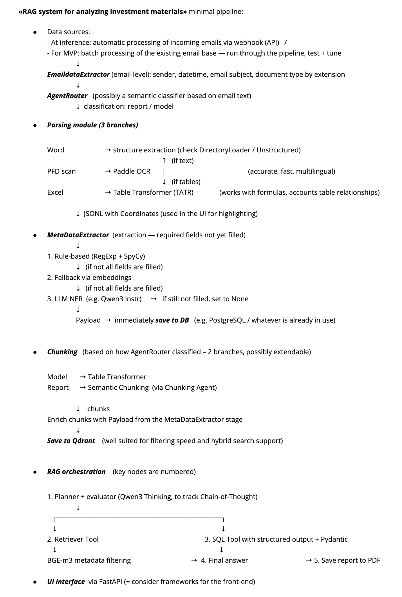
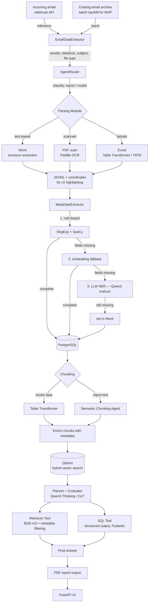

# Investment Document RAG — System Design

**The task was to design end-to-end RAG pipeline** that turns unstructured investment materials (reports, models, emails) arriving over email into a searchable, queryable knowledge base, detailed enough for an engineering team to build from, considering all possible trade-offs. 

## The brief

Investment teams receive a constant stream of unstructured documents by email — financial models in Excel, scanned PDF reports, Word memos — each with a different structure, format, and quality level. Analysts spend a disproportionate amount of time just *finding and extracting* the right numbers and context before they can even start analyzing. The brief was to design a system that removes that bottleneck: ingest documents automatically, normalize them into a structured, searchable form, and let analysts ask questions in natural language and get grounded, source-backed answers.

The design goal was to handle **heterogeneous, messy, real-world document types** (scanned reports, spreadsheets with formulas, structured Word docs) with a pipeline robust enough to degrade gracefully instead of failing silently.

## Design sketch

The diagram above is the cleaned-up version of the original whiteboard sketch this system was designed from:

## Architecture

### How the design works

**1. Ingestion.** Documents arrive as email attachments, picked up either via a live webhook (production) or batch-processed from an existing archive (for MVP training and evaluation). EmailDataExtractor pulls email-level metadata — sender, timestamp, subject, attachment type — before anything else happens.

**2. Routing.** AgentRouter classifies each incoming item (financial report vs. financial model) so the right downstream path is chosen, rather than forcing every document type through one parser.

**3. Parsing — format-aware.** Each source type gets the tool suited to it:

- **Word** → structural extraction (structure-aware loaders)
- **Scanned PDFs** → PaddleOCR, chosen for being accurate, fast, and multilingual
- **Excel** → Table Transformer (TATR), which understands formulas and cross-table relationships instead of flattening everything to text

Output is normalized to JSONL with coordinate metadata, so the UI can later highlight exactly where an answer came from in the source document.

**4. Metadata extraction — a fallback cascade.** Required fields are filled through an escalating chain: fast rule-based extraction (RegExp + SpaCy) first, falling back to embedding similarity, and only reaching for an LLM (Qwen3 Instruct, NER) when cheaper methods can't resolve a field. Anything still unresolved is explicitly set to `None` rather than guessed — traceable gaps beat silent hallucination.

**5. Chunking strategy split by content type.** Tabular model data goes through Table Transformer; narrative report text goes through an LLM-driven semantic chunking agent. Chunks are enriched with the metadata extracted earlier, then stored in **Qdrant**, chosen specifically for its filtering speed and native hybrid (dense + sparse) search support.

**6. RAG orchestration — a small agentic system.** A planner/evaluator node (Qwen3 in thinking mode, to keep chain-of-thought traceable) decides whether a query needs semantic retrieval, structured SQL lookup, or both, dispatching in parallel to a **Retriever Tool** (BGE-m3 embeddings + metadata filtering) and a **SQL Tool** (structured, Pydantic-validated output). Results are merged into a final answer, which can be exported as a PDF report.

**7. Delivery.** A FastAPI-based UI exposes the pipeline to analysts, with source highlighting powered by the coordinate metadata captured at parse time.

## Key design decisions

- **Format-specific parsing over a universal parser.** A single "read everything as text" approach silently destroys table structure and formula relationships — the pipeline routes by document type instead.
- **Cascading metadata extraction.** Expensive LLM calls are reserved for cases cheaper methods genuinely can't resolve, keeping cost and latency down without sacrificing coverage.
- **Explicit `None` over hallucinated fields.** Missing data is surfaced.
- **Hybrid search via Qdrant**, so retrieval isn't purely dependent on embedding quality — sparse/keyword signals catch what dense vectors miss.
- **Structured SQL path alongside semantic retrieval.** Every investment numeric/tabular question gets routed to a Pydantic-validated SQL tool instead of being forced through a vector store.
- **Traceability by design.** Coordinate-tagged chunks mean every answer can be traced back to its exact location in the source document.

## Tech stack

Python · FastAPI · LangGraph (multi-agent orchestration) · Qwen3 (Instruct & Thinking) · Qdrant (hybrid vector search) · BGE-m3 (embeddings) · PaddleOCR · Table Transformer (TATR) · PostgreSQL · SpaCy · Pydantic

## Status

**Deliverable: system design.** I was brought in to design this pipeline in detail, so that an engineering team could implement it. Covers ingestion, parsing, metadata extraction, storage, and agentic retrieval end to end.
